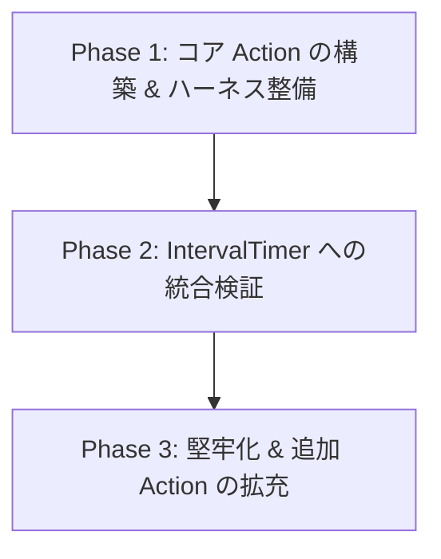

# ロードマップ (ROADMAP)

本リポジトリ (`asabon-lab/android-actions`) の開発計画および今後の機能拡張ロードマップです。

---

## 🧭 フェーズ概要

---

## Phase 1: コア Action の構築 & ハーネス整備（完了）

- [x] **基盤 Composite Action の作成**
  - [x] `setup-keystore`: Base64 キーストアのデコード・配置
  - [x] `promote-play`: Google Play Developer API によるトラック昇格（二重防止ガード・Dry-run付き）
  - [x] `publish-release`: GitHub Releases 作成・ドラフト昇格・成果物アップロード
- [x] **品質管理基盤の整備**
  - [x] Python スクリプト単体テスト（`test_promote_track.py` 等）
  - [x] GitHub Actions CI（`.github/workflows/ci.yml`）
  - [x] `uv` によるパッケージ管理 & Ruff（Linter / Formatter）の導入
- [x] **AI ハーネス開発環境の整備**
  - [x] `AGENTS.md`、`.githooks/`、`.agents/`（ルール・スキル）、`docs/` の構築

---

## Phase 2: IntervalTimer への統合検証（完了）

- [x] **リリースタグ (`v1.0.0` / `v1.1.0` / `v1`) の発行**
- [x] **IntervalTimer 側ワークフローの移行**
  - [x] `IntervalTimer` の `promote-production.yml` で `promote-play` および `publish-release` を採用
  - [x] `IntervalTimer` の `release.yml` で `setup-keystore` および `publish-release` を採用
  - [x] `IntervalTimer` の重複スクリプト（`promote_to_production.py`）の削除
- [x] **本番動作検証 & 改善フィードバック反映**

---

## Phase 3: 堅牢化 & 追加 Action の拡充（進行中）

- [ ] **Action の堅牢化・追加オプション対応**
  - [x] `publish-release`: Python 化・Job Summary 出力（折りたたみ式リリースノート対応）
  - [x] `analyze-build-log`: `enable-summary` / `emit-annotations` オプションによる出力制御
  - [ ] `publish-release`: 複数タグ・アセットの動的マッピング対応
  - [ ] `promote-play`: 段階的公開（Staged Rollout）の自動インクリメント対応
- [ ] **新規 Android 開発用 Action の追加・拡充**
  - [x] `analyze-build-log`: Android ビルドログの解析・アノテーション・Job Summary レポート出力（`android-build-log-analyzer` の統合）
  - [ ] `setup-android-sdk`: Android SDK / Command-line Tools のキャッシュ付きセットアップ
  - [ ] `run-android-lint`: Android Lint の実行 & PR コメント通知
